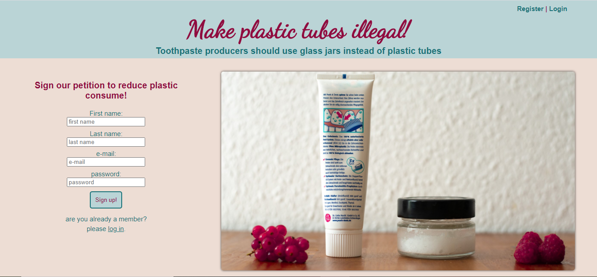
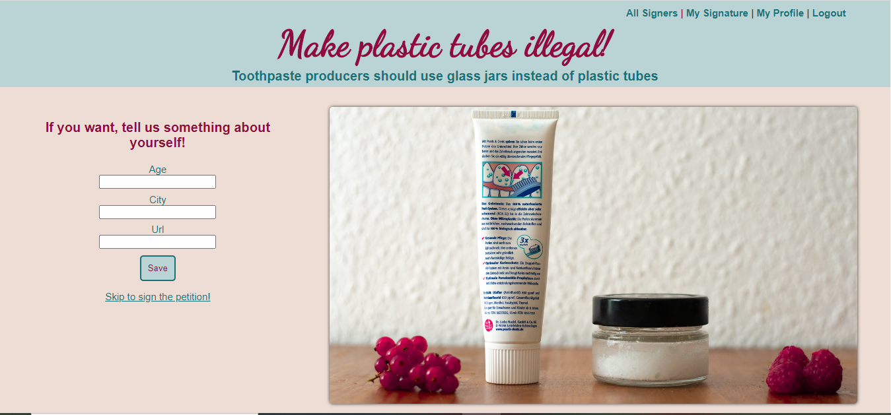
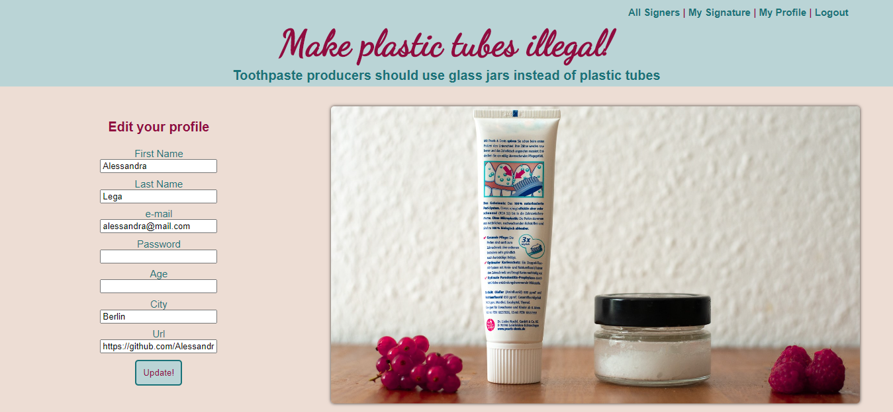
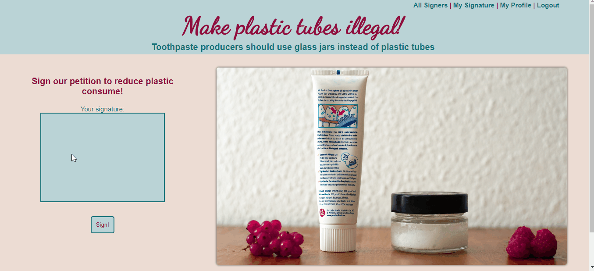
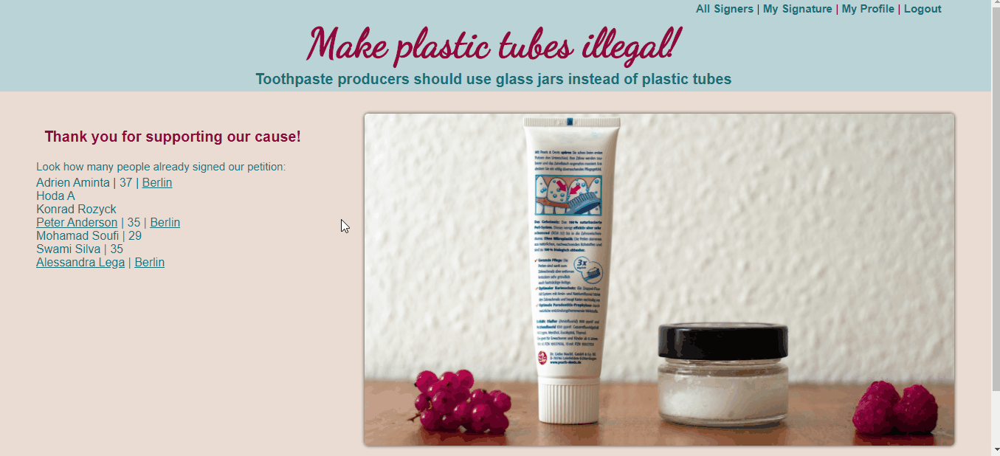

# ONLINE PETITION TO FORBID PLASTIC IN TOOTHPASTE PACKAGING

## Description:

Online zero-waste petition to forbid the use of plastic tubes for toothpaste and promote the use of glass jars.

## Developed with:

-   Node.js
-   Express.js
-   Express-handlebars
-   PostgreSQL
-   Bcryptjs
-   Cookie-session
-   csurf
-   jQuery
-   canvas2D
-   HTML/CSS
-   Media-Queries for mobile version
-   deployed on Heroku
-   tested with jest

## Features:

Welcome page for registration or login, the users can switch from registration to login with a link or using the navigation bar. An error message appears if the data is invalid or the password for login is wrong

 

 

After registering the users can also provide additional (optional) information about themselves or skip directly to the signing page. If the age is not a number, a customized error will appear. Users can always change their profile information as well as the password by visiting the "my profile" page.

 

 

After completing their profile, users are redirected to the signature page, where they can sign the petition with the mouse. After signing, users will see their signatures and can decide to delete it, if they made a mistake. Users can always access their signature and delete it, if they want, from the navigation bar under "my signature".

The canvas was developed for touch events too.

Following the link or from the navigation bar under "Signers", users can see the list of supporters of the petition.

-   Clicking on the city the list will show only the signers from that city.
-   If the users provided a url, the users will be able to reach this page by clicking on the name.

